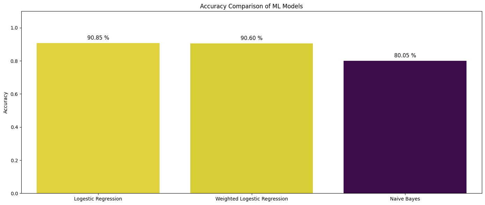
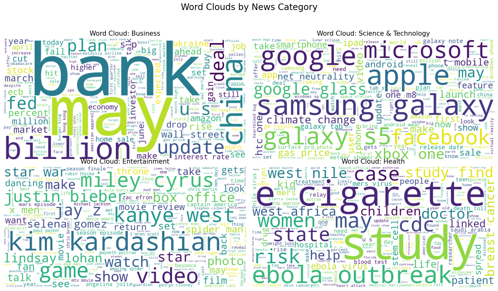
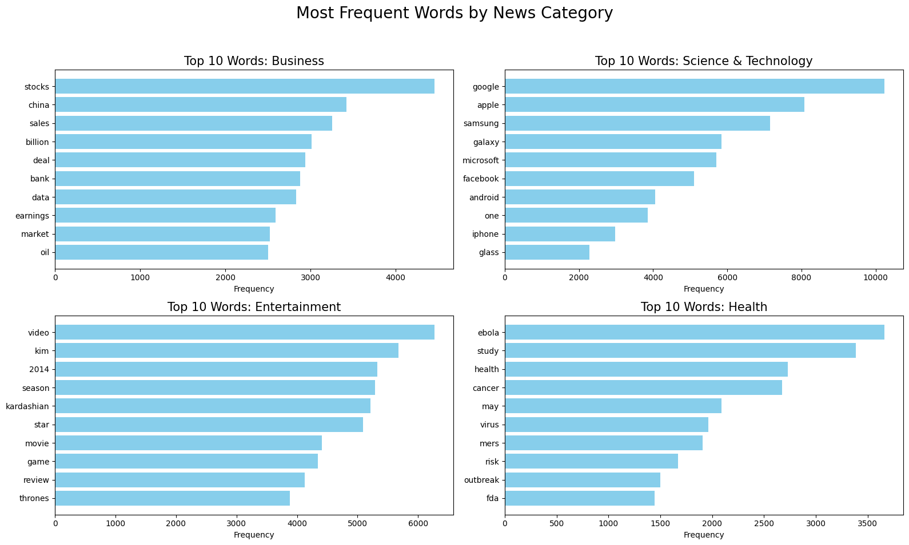

# News Aggregator Classification Model

<div align="center">

[](https://python.org)
[](https://python.org)
[](https://numpy.org)
[](https://scikit-learn.org)
[](https://matplotlib.org)
[](https://seaborn.pydata.org)
[](https://seaborn.pydata.org)
</div>


## 📑 Description

This project implements a machine learning model to analyze and classify news articles into categories based on their headlines. Using the **UCI News Aggregator Dataset**, the model distinguishes between four major topics: Business, Science & Technology, Entertainment, and Health.

The solution involves a comprehensive Natural Language Processing (NLP) pipeline for cleaning text data and utilizes a **Logistic Regression** and **Naive Bayes** classifier to achieve high accuracy.

## 📂 Dataset

The model is trained on the [**AG News / UCI News Aggregator Dataset**](https://www.kaggle.com/datasets/uciml/news-aggregator-dataset/data).
The dataset consists of news titles categorized into the following classes:

* **b**: Business
* **t**: Science and Technology
* **e**: Entertainment
* **m**: Health

## 📂 Project Structure

```
|── Dataset         # Dataset Folder
├── assets
│   ├── acc.png
│   ├── words.png
│   └── words2.png
├── .gitignore
├── Column.py       # A helper Python script
├── Model.ipynb     # The main Jupyter Notebook
└── Readme.md
```

## ⚙️ Methodology

### 1. Data Preprocessing

Raw text data is transformed into a clean format suitable for modeling through the following steps:

* **Lowercasing**: Converting all text to lowercase for uniformity.
* **Noise Removal**: Removing single letters and special characters.
* **Tokenization**: Splitting sentences into individual words using NLTK.
* **Stopword Removal**: Filtering out common English words (e.g., "the", "is", "at") that add little semantic meaning.
* **Lemmatization**: Reducing words to their base forms (verbs).
* **Punctuation Removal**: Stripping all punctuation marks.
* **Reconstruction**: Converting token lists back into string format for vectorization.

### 2. Feature Extraction

* **TF-IDF (Term Frequency-Inverse Document Frequency)**: The cleaned text is converted into numerical vectors using `TfidfVectorizer` with a maximum of **65,000 features**.

### 3. Model Details

1- **Algorithm**: Logistic Regression.
* **Hyperparameters**:
* `solver`: 'saga' (efficient for large datasets).
* `C`: 10 (Inverse of regularization strength).
* `max_iter`: 1000 (To ensure convergence).

2- **Algorithm**: Naive Bayes.
* **Hyperparameters**: Default Hyperparameters

> **Data Split**: The dataset is split into **80% training** and **20% testing** sets.

## 📊 Results

The model demonstrates strong performance on the test dataset:

* **Logistic Regression Accuracy**: **~94.83%**
* **Naive Bayes Accuracy**: **~92.35%**


## ✅ Models Accuracy Matrix



## 📍 Visualize the most frequent Words in Classes With **Word Clouds**


## 📍 Visualize the most frequent Words in Dataset Classes


