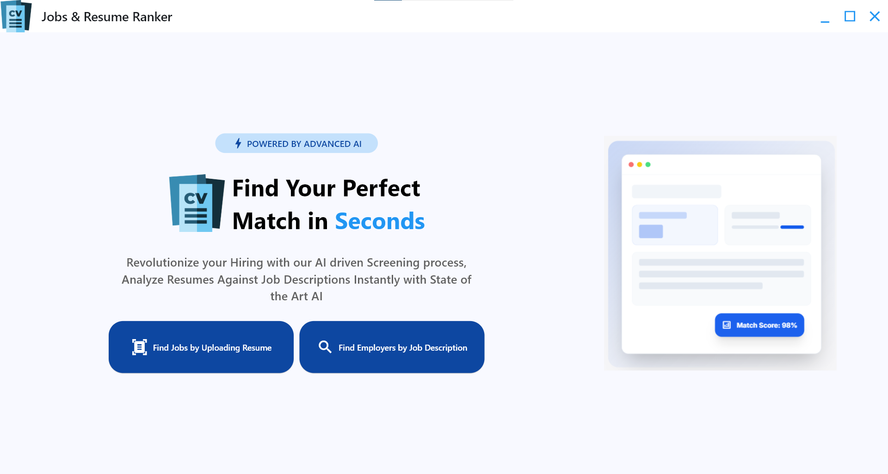

# Jobs & Resume Ranker

<div align="center">

[](https://python.org)
[](https://huggingface.co/)
[](https://scikit-learn.org/stable/)
[](https://pandas.pydata.org/)
[](https://numpy.org)
[](https://numpy.org)
</div>

## 📑 Description

An AI-powered desktop application built with **Python** and **Flet** that revolutionizes the hiring and job search process. By leveraging **Natural Language Processing (NLP)** and advanced transformer models, this tool intelligently bridges the gap between job seekers and employers through semantic matching.

## ✨ Key Features

**💻 Bi-Directional Matching Engine:**
* **For Employers:** Paste a job description, select a local directory of CVs (PDFs), and instantly generate a ranked list of the best candidates based on semantic similarity.
* **For Job Seekers:** Upload your resume, apply filters (Qualifications, Work Type, Gender), and discover the top job postings that match your specific skill set and experience.


**🧠 Advanced NLP Integration:** Utilizes the `all-MiniLM-L6-v2` SentenceTransformer model combined with Cosine Similarity to understand the *contextual* meaning of resumes and job descriptions, moving beyond simple keyword matching.

**🔍 Intelligent Skill Extraction:** Powered by `spaCy` Named Entity Recognition (NER) to automatically identify and extract core skills from resumes and job postings.

**💻 Modern Desktop UI:** A responsive, sleek, and intuitive graphical interface built entirely in Python using the `Flet` framework.

**📄 Seamless PDF Parsing:** Extracts and cleans text directly from candidate resumes using `PyMuPDF`.


## 📊 Datasets & Preprocessing

To ensure highly accurate semantic matching, the system relies on comprehensive datasets and a robust data cleaning pipeline.

### Datasets Used

* **[Resume Dataset](https://www.kaggle.com/datasets/snehaanbhawal/resume-dataset):** A diverse collection of candidate resumes used to test and validate the employer-facing CV ranking engine.
* **[Job Description Dataset](https://www.kaggle.com/datasets/ravindrasinghrana/job-description-dataset):** A massive dataset containing over 1.6 million job descriptions, detailing qualifications, work types, required skills, and company profiles.

### Data Preprocessing Pipeline

Before the data is fed into the AI matching engine, it undergoes several layers of processing to extract the most relevant semantic features:

1. **Dataset Optimization & Splitting:**
* Handled the 1.6M+ row Job Description dataset by splitting it into two distinct, relational datasets: `Jobs.csv` (containing roles, salaries, required skills, and descriptions) and `Companies.csv` (containing company profiles, geographical coordinates, and contact details).
* Converted raw date strings into standard `datetime` objects for easier temporal filtering.


2. **Resume Parsing & Text Cleaning:**
* Extracted raw text from PDF resumes using `PyMuPDF`.
* Standardized the text by converting everything to lowercase.
* Applied Regular Expressions (RegEx) to strip out special characters, numbers, and punctuation, retaining only alphabetic characters (`[^a-z\n]`).
* Removed redundant spaces and formatting anomalies to create a continuous, clean text string for the AI model.


3. **Dynamic Skill Extraction (NER):**
* Utilized `spaCy` to create a custom Named Entity Recognition (NER) pipeline via an `EntityRuler`.
* Dynamically identified known skills from the Job Description dataset and mapped them directly against the text in candidate CVs, ensuring explicit hard skills are highlighted in the UI alongside the AI match score.


4. **Semantic Vectorization:**
* Both the cleaned resumes and job descriptions are passed through the `all-MiniLM-L6-v2` sentence transformer, converting the raw text into dense, high-dimensional vector embeddings, preparing them for **Cosine Similarity scoring**.

## 💻 Project Demo
[](https://drive.google.com/file/d/1tH0lgxNAL2pXyfL_1cpuj7Daj9tfjBq1/view?usp=sharing)

> 📍 Note: You can click image to See **`Project Demo`**

## 🛠️ Technology Stack

* **Frontend:** [Flet](https://flet.dev/) (Flutter for Python)
* **Machine Learning / NLP:** `sentence-transformers`, `scikit-learn`, `spaCy`
* **Data Processing:** `pandas`, `numpy`
* **Document Parsing:** `PyMuPDF` 

## 📂 Project Structure

```text
├── all-MiniLM-L6-v2/
├── Datasets
│   ├── Job Descriptions/
│   │   ├── Bank.txt
│   │   ├── BusinessDevelopment.txt
│   │   ├── HR.txt
│   │   ├── PR.txt
│   │   └── Sales.txt
│   ├── Resumes/
│   ├── Companies.csv
│   ├── Jobs.csv
│   └── job_descriptions.csv
├── Notebooks
│   ├── Employers.ipynb
│   ├── Job.ipynb
│   ├── Model.ipynb
│   └── cv.ipynb
├── Screens
│   ├── Widgets
│   │   └── CustomWidgets.py
│   ├── EmployersCV.py
│   ├── EmployersRank.py
│   ├── Intro.py
│   ├── JobsCV.py
│   └── JobsRank.py
├── assets
│   ├── icons
│   │   ├── cv.ico
│   │   └── cv.png
│   └── image.png
├── .gitignore
├── DataTransmiter.py
├── Employers.py
├── Jobs.py
├── Readme.md
├── main.py
└── requirements.txt
```

## ⚙️ Installation & Setup

1. **Clone the repository:**
```bash
git clone https://github.com/yourusername/jobs-resume-ranker.git
cd jobs-resume-ranker

```

2. **Install Dependencies:**
```bash
pip install -r requirements.txt

```


3. **Download the required SpaCy model:**
The application uses the small English core web model for skill extraction.
```bash
python -m spacy download en_core_web_sm

```


4. **Prepare the Datasets:**
Ensure that the `Dataset/` folder exists in your root directory and contains the necessary files (`Jobs.csv` and `Companies.csv`) generated from the data wrangling phase in the `Notebooks/` directory.

## 🚀 Usage

Run the application locally using Python:

```bash
python main.py

```


### 🏢 Employer Mode

1. Click **"Find Employers by Job Description"**.
2. Paste the full target Job Description into the text area.
3. Click the upload area to select the local folder containing the candidate resumes (PDF format).
4. Click **"Find Best Match"** to view the ranked list of candidates with percentage scores.

### 💼 Job Seeker Mode

1. Click **"Find Jobs by Uploading Resume"**.
2. Set your desired filtering parameters (Qualifications, Work Type, Gender).
3. Upload your resume (PDF).
4. Click **"Find Jobs Based on your Resume"** to get a curated, ranked list of the best job openings. You can click the location icon to view the company on Google Maps.

---
<h3 align="center">Developed as part of the Elevvo Pathways Internship - Industry Level</h3>