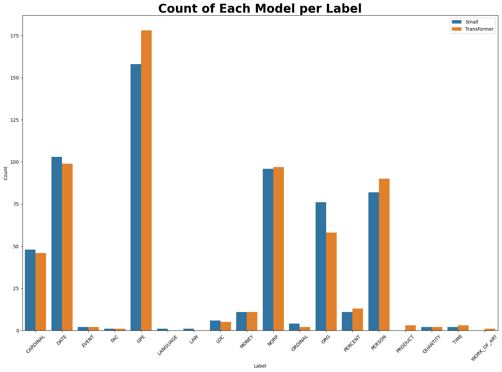

# Named Entity Recognition (NER) from News Articles


<div align="center">

[](https://python.org)
[](https://scikit-learn.org)
[](https://python.org)
[](https://matplotlib.org)
[](https://seaborn.pydata.org)

</div>

## 📑 Description

This project implements a **Named Entity Recognition (NER)** system to identify and categorize entities such as people, locations, and organizations within news articles. The system utilizes the **CoNLL 2003** dataset and compares multiple extraction strategies, including manual rule-based patterns and advanced transformer-based statistical models.

## 📂 Dataset

The project uses the **[CoNLL-2003 English Version](https://www.kaggle.com/datasets/alaakhaled/conll003-englishversion/data)** dataset from Kaggle.

* **Format**: IOB/BIO tagging system.
  
* **Entities**: Person (PER), Organization (ORG), Location (LOC), and Miscellaneous (MISC).

* **Files**: `train.txt`, `valid.txt`, and `test.txt`.


## 📁 Project Structure

```
├── Dataset
│   ├── train.txt         # CoNLL-2003 raw text files
│   ├── valid.txt
│   └── test.txt
├── assets
│   ├── acc.png
│   ├── words.png
│   └── words2.png
├── .gitignore
├── Model.ipynb         # Main implementation and model 
└── Readme.md
```

## ⚙️ Methodology

### 1. Data Preparation

* **Parsing**: A custom `Load_data` function processes the CoNLL text files, skipping document headers (`-DOCSTART-`) and joining tokens into full sentences for processing.


* **Consolidation**: Training, validation, and test sets are merged into a primary `Dataset` for broad analysis.


### 2. NER Approaches

* **Rule-Based**: Implemented using spaCy's `EntityRuler` to define explicit patterns for specific entities (e.g., "Apple Inc" as an ORG).


* **Model-Based (Small)**: Utilizes the `en_core_web_sm` model, a lightweight statistical hybrid for fast extraction.


* **Model-Based (Transformer)**: Utilizes the `en_core_web_trf` model, a RoBERTa-based transformer for state-of-the-art accuracy.


### 3. Comparison & Categorization

* The models are compared by processing a subset of 200 sentences.


* Entities are categorized into a structured Pandas DataFrame containing the Entity text, Label, and the source Model.


## 📊 Results & Visualization

### Model Comparison

The project provides a statistical breakdown of how different models categorize the same text. The Transformer model consistently identifies more nuanced entities (like `GPE` and `NORP`) compared to the lightweight model.





---

<h3 align="center">Developed as part of the Elevvo Pathways Internship - Level 2</h3>