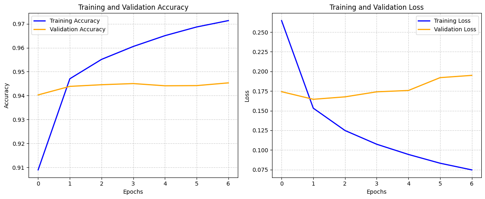

# News Aggregator Classification Model

<div align="center">

[](https://python.org)
[](https://scikit-learn.org)
[](https://www.tensorflow.org/)
[](https://pandas.pydata.org/)
[](https://numpy.org)
[](https://matplotlib.org)
[](https://seaborn.pydata.org)
[](https://seaborn.pydata.org)
</div>


## 📑 Description

This project implements a Machine Learning and Deep Learning models to analyze and classify news articles into categories based on their headlines. Using the **UCI News Aggregator Dataset**, the model distinguishes between four major topics: Business, Science & Technology, Entertainment, and Health.

The solution involves a comprehensive Natural Language Processing (NLP) pipeline for cleaning text data and utilizes a **Logistic Regression**, **Naive Bayes** ,and **Bidirectional LSTM** Models to achieve high accuracy.

## 📂 Dataset

The model is trained on the [**AG News / UCI News Aggregator Dataset**](https://www.kaggle.com/datasets/uciml/news-aggregator-dataset/data).
The dataset consists of news titles categorized into the following classes:

* **b**: Business
* **t**: Science and Technology
* **e**: Entertainment
* **m**: Health

## 📂 Project Structure

```
|── Dataset   
│   ├── AGNews.csv
│   └── CleanedAGNews.csv
├── assets
│   ├── acc.png
│   ├── acc2.png
│   ├── words.png
│   └── words2.png
├── .gitignore
├── Column.py            # A helper Python script
├── Model.ipynb          # The main Jupyter Notebook
├── LSTM_Model.ipynb     # The Jupyter Notebook for LSTM
└── Readme.md
```

## ⚙️ Methodology

### 1. Data Preprocessing

Raw text data is transformed into a clean format suitable for modeling through the following steps:

* **Lowercasing**: Converting all text to lowercase for uniformity.
* **Noise Removal**: Removing single letters and special characters.
* **Tokenization**: Splitting sentences into individual words using NLTK.
* **Stopword Removal**: Filtering out common English words (e.g., "the", "is", "at") that add little semantic meaning.
* **Lemmatization**: Reducing words to their base forms (verbs).
* **Punctuation Removal**: Stripping all punctuation marks.
* **Reconstruction**: Converting token lists back into string format for vectorization.

### 2. Feature Extraction

* **TF-IDF (Term Frequency-Inverse Document Frequency)**: The cleaned text is converted into numerical vectors using `TfidfVectorizer` with a maximum of **65,000 features**.

### 3. Model Details

1- **Algorithm**: Logistic Regression.
* **Hyperparameters**:
* `solver`: 'saga' (efficient for large datasets).
* `C`: 10 (Inverse of regularization strength).
* `max_iter`: 1000 (To ensure convergence).

2- **Algorithm**: Naive Bayes.
* **Hyperparameters**: Default Hyperparameters

> **Data Split**: The dataset is split into **80% training** and **20% testing** sets.

## 🧠 Deep Learning Approach: Bidirectional LSTM Model

In addition to traditional Machine Learning models, we built a Deep Learning model using a **Bidirectional LSTM (Long Short-Term Memory)** network to capture the sequential context of the news titles. 

### ⚙️ What we did in the LSTM Notebook:
1. **Data Preparation & Splitting:** 
   * Loaded the UCI News Aggregator dataset and dropped null values.
   * Extracted the `TITLE` as features and `CATEGORY` as the target variable.
   * Split the data into Training (80%) and Testing (20%) sets.
2. **Text Tokenization & Padding:** 
   * Initialized a Keras `Tokenizer` with a vocabulary size (`VOCAB_SIZE`) of 20,000 words and an `<OOV>` token for unknown words.
   * Converted the text sentences into numerical sequences.
   * Applied post-padding to ensure all sequences had a uniform length (`MAX_LEN = 10`).
3. **Label Encoding & Class Balancing:** 
   * Used `LabelEncoder` to transform text categories into integers, followed by `to_categorical` for one-hot encoding.
   * Handled dataset imbalance by calculating and applying balanced class weights.
4. **Model Architecture:**
   * **Embedding Layer:** Mapped the 20,000-word vocabulary into dense vectors of size 256.
   * **Bidirectional LSTM Layer 1:** 128 units returning sequences to capture both forward and backward dependencies.
   * **Dropout Layer:** 50% dropout rate to prevent overfitting.
   * **Bidirectional LSTM Layer 2:** 32 units to distill high-level temporal features.
   * **Dropout Layer:** Another 50% dropout rate.
   * **Dense Output Layer:** 4 units with a `softmax` activation to classify the text into the 4 target categories.
5. **Training:** 
   * Compiled using the `adam` optimizer and `categorical_crossentropy` loss function.
   * Trained for 20 epochs with a batch size of 256.
   * Implemented an `EarlyStopping` callback (patience of 6) to restore the best weights and prevent overfitting.

## 📊 Results

The model demonstrates strong performance on the test dataset:

* **Logistic Regression Accuracy**: **~94.55%**
* **Naive Bayes Accuracy**: **~92.27%**
* **Bidirectional LSTM Accuracy**: **~94.39%**


## ✅ Models Accuracy Matrix


## ✅ Accuracy and Loss graphs



## 📍 Visualize the most frequent Words in Classes With **Word Clouds**


## 📍 Visualize the most frequent Words in Dataset Classes


---
<h3 align="center">Developed as part of the Elevvo Pathways Internship - Level 1</h3>