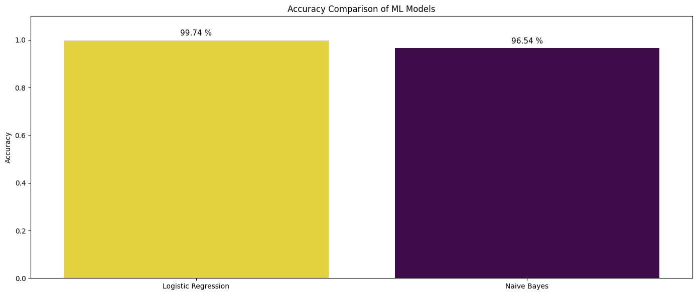

# Fake News Classification Model

<div align="center">

[](https://python.org)
[](https://python.org)
[](https://numpy.org)
[](https://scikit-learn.org)
[](https://matplotlib.org)
[](https://seaborn.pydata.org)
[](https://seaborn.pydata.org)
</div>

## 📌 Overview
This project builds a Machine Learning model to classify news articles as **Real** or **Fake**. It utilizes Natural Language Processing (NLP) techniques for text preprocessing and feature extraction, comparing two classification algorithms: **Logistic Regression** and **Multinomial Naive Bayes**.

The model achieves high accuracy in distinguishing between legitimate news and fake news based on textual content.

## 📂 Dataset
The project uses the [**Fake and Real News Dataset**](https://www.kaggle.com/datasets/clmentbisaillon/fake-and-real-news-dataset/data) (likely from Kaggle), consisting of two CSV files:
* `True.csv`: Contains articles identified as real news (Class `0`).
* `Fake.csv`: Contains articles identified as fake news (Class `1`).


## 📁 Project Structure
```
|── Dataset         # Dataset Folder
├── assets
│   ├── acc.png
│   ├── words.png
│   └── words2.png
├── .gitignore
├── Column.py       # A helper Python script
├── Model.ipynb     # The main Jupyter Notebook
└── Readme.md
```


## ⚙️ Methodology

### 1. Data Preprocessing
* **Loading**: Merging `True.csv` and `Fake.csv` into a single dataframe.
* **Cleaning**:
    * Lowercasing text.
    * Removing single characters.
    * Removing non-alphabetic characters (special symbols, numbers).
    * (Utilizes a helper module `Column.py` for column-specific updates).
* **Feature Extraction**:
    * **TF-IDF Vectorizer**: Converts text into numerical vectors.
    * *Parameters*: `max_features=65000`, `ngram_range=(1, 3)` (Unigrams, Bigrams, and Trigrams).

### 2. Model Training
The dataset is split into training (80%) and testing (20%) sets. Two models are trained:

1.  **Logistic Regression** (Solver: `saga`, `C=10`)
2.  **Multinomial Naive Bayes**

## 📊 Results

The models were evaluated using Accuracy and F1-Score.

| Model | Accuracy | F1-Score |
| :--- | :--- | :--- |
| **Logistic Regression** | **99.74%** | **99.75%** |
| **Naive Bayes** | 96.54% | 96.67% |

*Logistic Regression proved to be the superior model for this specific dataset and feature set.*

## ✅ Models Accuracy Matrix



## 📍 Visualize the most frequent Words in **Real News**


## 📍 Visualize the most frequent Words in **Fake News**

