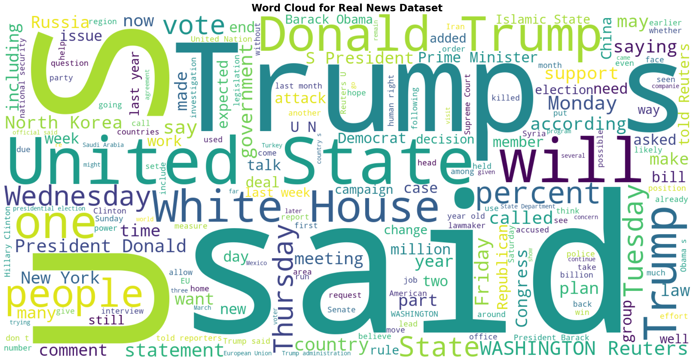
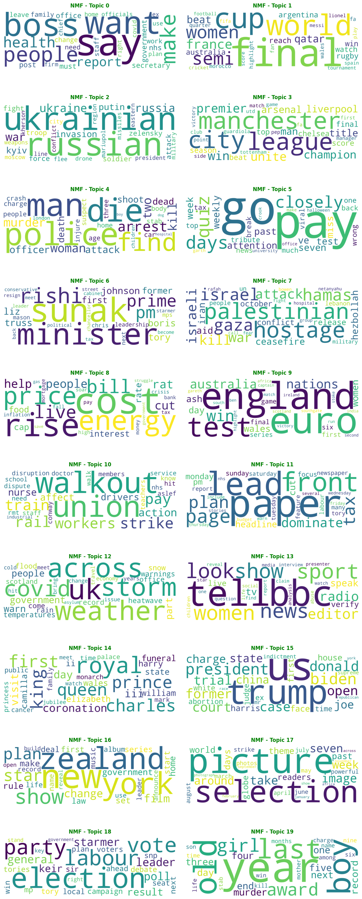

# BBC News Topic Modeling

<div align="center">

[](https://python.org)
[](https://python.org)
[](https://numpy.org)
[](https://scikit-learn.org)
[](https://matplotlib.org)
[](https://seaborn.pydata.org)
[](https://seaborn.pydata.org)
</div>

## 🚀 Overview

This repository contains a Jupyter Notebook (`Model.ipynb`) that demonstrates how to perform Topic Modeling on a BBC News dataset using Natural Language Processing (NLP) techniques and Machine Learning pipelines.


## ⚙️ Methodology

The notebook covers the entire pipeline from raw text to topic extraction:

1. **Data Loading & Consolidation:** - Reads [**The BBC News dataset**](https://www.kaggle.com/datasets/gpreda/bbc-news/data) and creates a unified `text` feature by combining the article `title` and `description`.
   - Cleans missing values and duplicate rows.
   
2. **Text Cleaning & Preprocessing (via Custom `Column` class):** 
   - Lowercasing all text.
   - Removing single-letter words and all punctuation using Regular Expressions.
   - Tokenization.
   - Stopwords removal using NLTK (`stopwords.words("english")`).
   - Lemmatization using `WordNetLemmatizer`.

3. **Modeling:**
   - Evaluates word frequencies using **TF-IDF Vectorization** (`TfidfVectorizer`).
   - Builds two separate Scikit-Learn `Pipeline`s to discover 20 underlying topics:
     - **Latent Dirichlet Allocation (LDA)**
     - **Non-Negative Matrix Factorization (NMF)**

4. **Visualization & Analysis:**
   - Extracts and displays the top 10 contributing words for each topic.
   - Classifies individual news rows into their dominant topics.
   - Provides an interactive HTML visualization of the LDA model using `pyLDAvis`.

## 🛠️ Technologies Used
* **Data Manipulation:** `pandas`, `numpy`, `re`
* **NLP:** `nltk` (corpus, tokenize, stem)
* **Machine Learning:** `scikit-learn` (Pipelines, TfidfVectorizer, LatentDirichletAllocation, NMF)
* **Visualization:** `pyLDAvis`, `matplotlib`, `wordcloud`


## 📁 Project Structure
```
|── Dataset         # Dataset Folder
├── assets
│   ├── words.png
│   └── words2.png
├── .gitignore
├── Column.py       # A helper Python script
├── Model.ipynb     # The main Jupyter Notebook
└── Readme.md
```


## 📍 Visualize the most frequent Words in **LDA** Topics
 

## 📍 Visualize the most frequent Words in **NMF** Topics


---
<h3 align="center">Developed as part of the Elevvo Pathways Internship - Level 2</h3>